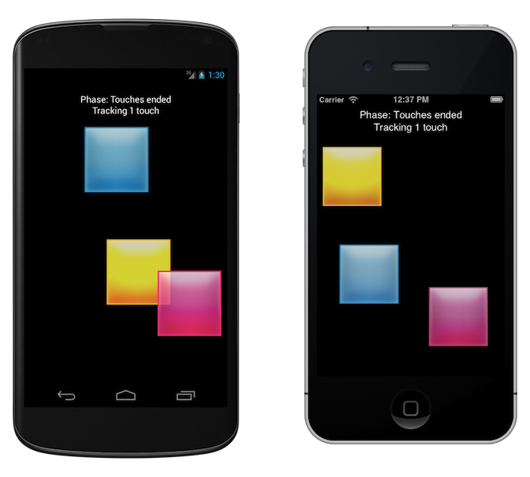

```java
GraphicsRect frame = mainScreen.getApplicationFrame();
window.setFrame(frame);
window.makeKeyAndVisible();
```



Project under development. Visit [GitHub](https://github.com/KavaProject/KavaTouch) if you want to participate!